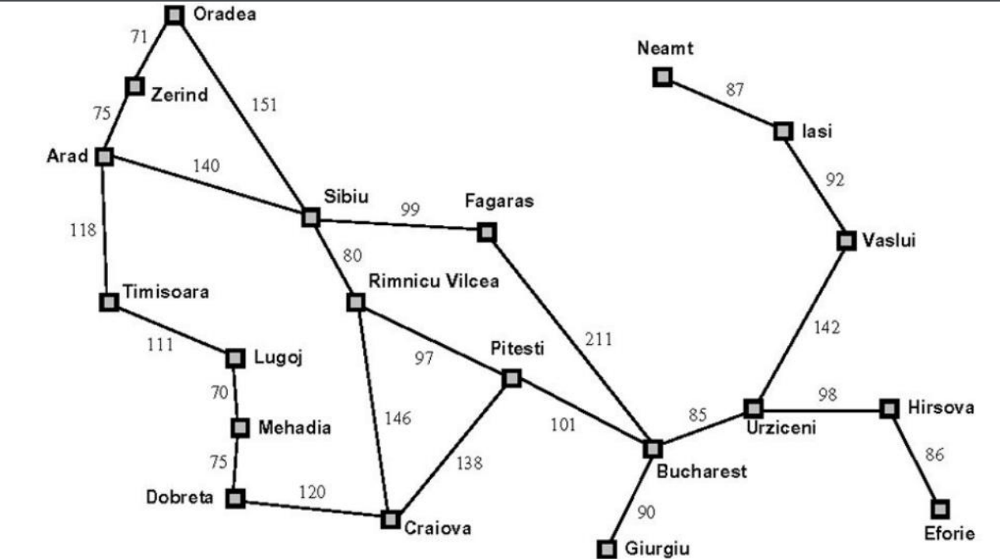

# ALGORITMO DE BÚSQUEDA

Mapa de Rumanía con los costes entre ciudades

En el proyecto debemos encontrar las rutas mas cortas entre las diferentes ciudades

## MÉTODOS USADOS

1. DFS(Depth First Graph Search): Con este método vamos añadiendo los diferentes nodos a una pila y comprobando si el nodo es el objetivo, si no lo es añadimos los nuevos nodos al principio de la pila.

2. BFS(Breath First Graph Search): Con este método añadimos los nodos a una cola usando FIFO y comprobando si este es el objetivo, si no lo es seguimos añadiendo al final de la cola.

3. Ramificación y acotación(Branch & Bound): Con Branch & Bound añadiremos los nodos de uno a uno en una lista e iremos comprobando si es el objetivo, sino pasaremos al siguiente y cuando lo encontremos ordenaremos la lista en base al coste acumulado.

4. Ramificación y acotación con subestimación: Con este método vamos añadiendo a una lista los diferentes nodos y comprobando si este es el nodo objetivo, sino pasamos al siguiente y al final ordenamos la lista de mejor a peor según el coste acumulado y la heurística.

## ARCHIVOS

[run.py](./run.py) -> Aquí se encuentran las diferentes pruebas y los Output.

[search.py](./search.py) -> Aquí es donde se encuentra el programa principal y donde se realizaran todos los métodos, también se encuentran los valores de las diferentes ciudades.

[utils.py](./utils.py) -> En este archivo es donde se crean los metodos para las pilas, colas... que usaremos para los DFS y BFS.

## TESTS

| ID | Origen | Destino | Amplitud | Profundidad | Ramificación y acotación | Ramificación y acotación con subestimación |
|----|--------|---------|----------|-------------|--------------------------|---------------------------------------------|
| 1  | Arad   | Bucharest | **Generados:**21 **Visitados:**16 **Costo total:**450 **Ruta:**[Node B, Node F, Node S, Node A] | **Generados:**21 **Visitados:**16 **Costo total:**450 **Ruta:**[Node B, Node F, Node S, Node A]  | **Generados:**21 **Visitados:**16 **Costo total:**450 **Ruta:**[Node B, Node F, Node S, Node A]  | **Generados:**21 **Visitados:**16 **Costo total:**450 **Ruta:**[Node B, Node F, Node S, Node A]  |
| 2  | Oradea   | Eforie | **Generados:**45 **Visitados:**43 **Costo total:**730 **Ruta:**[Node E, Node H, Node U, Node B, Node F, Node S, Node O] | **Generados:**21 **Visitados:**16 **Costo total:**450 **Ruta:**[Node B, Node , Node , Node ]  | **Generados:**21 **Visitados:**16 **Costo total:**450 **Ruta:**[Node B, Node , Node , Node ]  | **Generados:**21 **Visitados:**16 **Costo total:**450 **Ruta:**[Node B, Node , Node , Node ]  |
| 3  | Giurgiu   | Zerind | **Generados:**41 **Visitados:**34 **Costo total:**615 **Ruta:**[Node B, Node ] | **Generados:**21 **Visitados:**16 **Costo total:**450 **Ruta:**[Node B, Node , Node , Node ]  | **Generados:**21 **Visitados:**16 **Costo total:**450 **Ruta:**[Node B, Node , Node , Node ]  | **Generados:**21 **Visitados:**16 **Costo total:**450 **Ruta:**[Node B, Node , Node , Node ]  |
| 4  | Neamt   | Dobreta | **Generados:**32 **Visitados:**26 **Costo total:**765 **Ruta:**[Node B, Node , Node , Node ] | **Generados:**21 **Visitados:**16 **Costo total:**450 **Ruta:**[Node B, Node , Node , Node ]  | **Generados:**21 **Visitados:**16 **Costo total:**450 **Ruta:**[Node B, Node , Node , Node ]  | **Generados:**21 **Visitados:**16 **Costo total:**450 **Ruta:**[Node B, Node , Node , Node ]  |
| 5  | Mehadia   | Faragas | **Generados:**3 **Visitados:**23 **Costo total:**520 **Ruta:**[Node B, Node , Node , Node ] | **Generados:**21 **Visitados:**16 **Costo total:**450 **Ruta:**[Node B, Node , Node , Node ]  | **Generados:**21 **Visitados:**16 **Costo total:**450 **Ruta:**[Node B, Node , Node , Node ]  | **Generados:**21 **Visitados:**16 **Costo total:**450 **Ruta:**[Node B, Node , Node , Node ]  |
